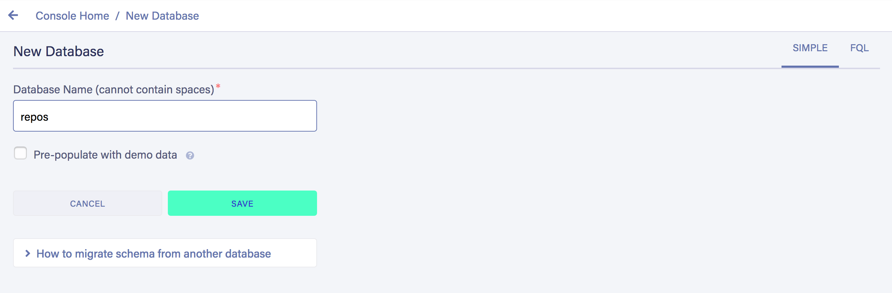
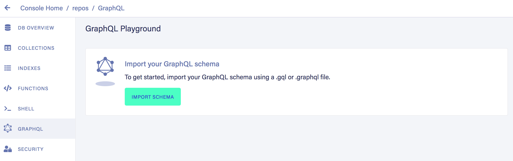
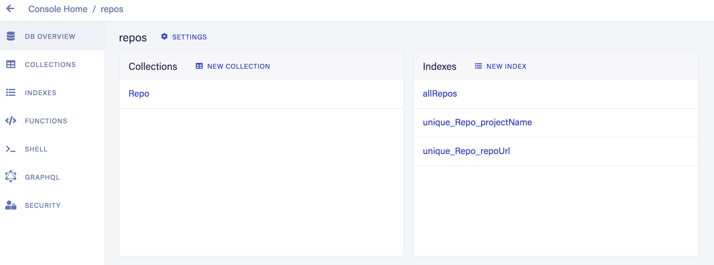

# Building a static Nuxt.js site with FaunaDB

In this article, we will build a Repository Catalogue, using Nuxt.js to generate
a static site, from FaunaDB data.

Pre-rendering at build time is not all we will be doing. We' ll also display
additional, more dynamic repo info, using Vue.js for client-side hydration.

Check out the working demo [here](https://elegant-hopper-28219e.netlify.app/).

## Why a Repository Catalogue?

As developers, we all have projects we admire/find interesting/look up to, and
like to keep track of.

The Repository Catalogue will serve as a collection of GitHub projects, that you
can customize to display repo information that is more relevant to you.

Although we'll be building a very concrete implementation, its main purpose is
to serve as an example to the core underlying idea of this article. The benefits
of pre-rendering as much as we can of a website, and through client-side
JavaScript. sprinkle it with just the more dynamic type of data. [static
first](https://css-tricks.com/static-first-pre-generated-jamstack-sites-with-serverless-rendering-as-a-fallback/)

> "It’s usually a good idea to load as much data at build time as possible to
> improve page performance. But if the data isn’t needed by all clients, or too
> big to be sent to the client all at once, we can split things up and switch to
> on-demand loading on the client. This is the case for user-specific data,
> pagination, or any data that changes rather frequently and might be outdated by
> the time it reaches the user. _[Build a dynamic JAMstack app with GatsbyJS and FaunaDB](https://css-tricks.com/build-a-dynamic-jamstack-app-with-gatsbyjs-and-faunadb/)_

When analyzing the requirements for a Repo Catalogue, we can straight away
identify two categories of data:

- some that does not change often or not at all (e.g., project name, logo, repo
  URL)
- some that changes frequently (e.g., repository number of stars and forks)

This observation may then lead us to the question:

- "Do we really need to keep making the same request, to get the same data, take
  those same results, run them against the same template, and only then, deliver
  the page to the client?".

What if we implement a Jamstack strategy, and strive to use the server side
build to fetch the repo collection, and serve HTML and static assets to our
site's visitors?

After all, only some projects a special place in our heart 😄, so it's not
_that_ often we need to add or delete a repo from the catalogue.

At the end, you'll be able to take this example, adapt and apply it to your
specific use case. You can also translate this tutorial context for other
real-time apps very easily, explain as go along in the article.

## Jamstack

The concepts of Jamstack and "static-first" are not new and their advantages
have been [extensively](https://css-tricks.com/static-or-not/)
[documented](https://css-tricks.com/get-static/) before. Jamstack architectures
allow us to build faster, more secure, more scalable websites.

With HTML being pre-rendered once and then statically served from a CDN, a
website has the potential for great performance. Fetching data at the build
stage - instead of each time a client requests a page, with minimum computing
overhead.

The term "static" can be a bit misleading - that's why we see "pre-rendered"
being used interchangeably. When we build a Jamstack app, it doesn't mean we
have to compromise on dynamic content and features.

We can build the site beforehand with the type of data that does not change
often, and augment it client-side, only if and when that's needed.

Moreover, the widespread of functionality APIs, makes way for common tasks -
such as authentication, e-commerce, and data storage - that used to be
implemented over and over, now be delegated to the professional service
providers.

## FaunaDB

FaunaDB is globally distributed, low-latency database, with native GraphQL
support, that promises to be always consistent and always secure.

As a serverless database, FaunaDB allows our applications to access data "as a
service". Contrary to more "traditional" relational databases, there's no need
to host and manage our own database. Zero server operations and transparent
scalability out-of-the-box.

From a developer's perspective this is awesome, because it allows us to be more
productive and focus solely on the logic of the app we're building.

## Nuxt.js

Nuxt.js is an open-source web application framework built on top of Vue.js. It
is well known for its SSR capabilities, but it can also do static.

Instead of having a Node server process each client request - eventually
fetching data from an API or database in between, we'll be using Nuxt as a
static site generator to do the heavy lifting during the build stage.

## Goals

What we're setting to achieve in this tutorial:

- building a pre-rendered Repo Catalogue site with Nuxt.js
- building a helper app that we'll use to seed Fauna's database

Although it's not the main focus of the article, the supporting `fauna-seeder`
app will allows us to populate the FaunaDB database with a single command from
the terminal. It's just one a way of storing data in FaunaDB - in fact, you
could be doing this step in a different way of your choice.

## Pre-requisites

Before we move on, I’d like to mention that although not mandatory, a working
knowledge of the following technologies is beneficial:

- JavaScript
- Vue.js/Nuxt.js
- GraphQL

Before you begin, you'll need:

- Node, npm, and npx installed
- A [FaunaDB account](https://dashboard.fauna.com/accounts/register)

Without further ado, let's dive in!

## Modelling our data

First things first, we begin by specifying the data model. The goal is to store
a collection of repos in a Fauna database.

Each repo is represented by the following fields:

- project name
- GitHub repo URL
- project logo
- project main color

## Writing the GraphQL schema

In this section, we'll be creating the helper app `fauna-seeder` that will
populate the database.

Inside this project, we'll also store the GraphQL schema we'll be writing to
define our repo data, The schema will be used in the next step to create the
database and specify what resources the database will provide.

> "GraphQL is a specification for an API query language and a server engine
> capable of executing such queries."[Production Ready GraphQL](https://book.productionreadygraphql.com/)

Create a directory for the project and navigate to it:

```shell
mkdir fauna-seeder
cd fauna-seeder
```

From within the root directory, create a new git repo:

```shell
git init
```

Configure git to ignore the `node_modules` directory and the `.env` file:

```shell
echo "node_modules" > .gitignore
echo ".env" >> .gitignore
```

Then, let's initialize a Node project:

```shell
npm init -y
```

This creates a `package.json` file where we can install the required
dependencies:

```shell
npm install dotenv faunadb simple-icons
```

We've installed three dependencies:

- faunadb: JavaScript driver for FaunaDB
- simple-icons: [Simple Icons](https://simpleicons.org/) npm package
- dotenv: to store and load Fauna's secret key from a `.env` file

[The Fauna Query Language](https://docs.fauna.com/fauna/current/api/fql/) (FQL)
is the native API for querying FaunaDB. [Fauna
drivers](https://docs.fauna.com/fauna/current/drivers/) (available for several
programming languages) abstract the FQL, allowing developers to programmatically
interact with FaunaDB databases.

Simple Icons is a cool project that collects SVG icons and colors for popular
brands. We'll be using their [npm
package](https://github.com/simple-icons/simple-icons) to get the SVG logo and
the hex color code of each project, when the seeder app runs.

Let's now write the GraphQL schema. Create a new file `schema.graphql`
and add the following content:

```shell
touch schema.gql
```

```graphql
type Repo {
  projectName: String! @unique
  repoUrl: String! @unique
  svgLogo: String
  colorHex: String
}

type Query {
  allRepos: [Repo!]!
}
```

As you may know, GraphQL uses a typed schema to specify entities and their
fields. We've declared the object type `Repo` to represent an individual
repository in the collection.

A repo has a project name, a repository URL, a SVG logo, and a color. The first
two fields are declared as non-nullable `!` and unique `@unique`. This
guarantees that a repo always has values for these required fields, and that
there are no repeated repos in the collection.

We've also declared a query `allRepos`, to list all the repos that are stored in
the collection.

## Creating a Fauna database

Log in to your Fauna account.

Visit the [dashboard](https://dashboard.fauna.com/) and create a new database,
named `repos`:



## Importing the schema

Now that the database is created, we can import the GraphQL schema into FaunaDB.

FaunaDB has a feature that allows us to import a GraphQL schema to create a
database, with an "instant" GraphQL endpoint for it.

We can upload our `schema.gql` file, via FaunaDB Console by clicking "GraphQL"
on the left sidebar:



Then click the "Import Schema" button, which opens your browser’s file upload,
and select the `schema.gql` file:

FaunaDB automatically created the necessary collection for the `Repo` entity.

Additionally, it also created the indexes to support the schema and are needed
to interact with the collection:



At this point we have an empty database, ready to be populated with some repo
data.

## Seeding data to Fauna

Inside a Fauna database, we have Collections, Indexes and Documents.
FaunaDB is a non-relational database that stores data in the JSON format. There
are three ways of interacting with Fauna data:

- Fauna drivers
- Interactive Shell using FQL
- GraphQL Playground
- GraphQL API using a GraphQL client (e.g., Apollo)

We'll use the JavaScript [driver](https://github.com/fauna/faunadb-js), that
we've already installed in a previous step.

The driver requires a Fauna Admin Key in order to access and write data in the
`repos` database.

From the database's dashboard, go to "Security" on the left-hand, and create a
new key with "Admin" Role.

Copy the generated key and save it somewhere safe, as after you navigate away
from this page it will not be displayed again:


Create a `.env` file in the root directory of the `fauna-seeder` app:

```shell
touch .env
```

Add the environment variable `FAUNA_ADMIN_KEY` and paste the generated key right
after the variable's name:

```
FAUNA_ADMIN_KEY=
```

From here, we just need to reference `process.env.FAUNA_ADMIN_KEY` to access the
key from within our code.

Let's create a function that handles a client connection to Fauna:

```shell
mkdir functions
cd functions
touch db-connection.js
```

Add the following to `db-connection.js`:

```javascript
require("dotenv").config();
const faunadb = require("faunadb");
const query = faunadb.query;

function createClient() {
  if (!process.env.FAUNA_ADMIN) {
    throw new Error("FAUNA_ADMIN key not found");
  }
  const client = new faunadb.Client({
    secret: process.env.FAUNA_ADMIN,
  });
  return client;
}

exports.client = createClient();
exports.query = query;
```

What are we doing there
to make it easier to include local data structures in queries, and for
processing query results. FQL the native API for querying the data FQL
functional, composable

## Repo data

We'll be using JSON to store the minimal set of repo data the seeder app
requires.

Each repo is represented by three properties:

```json
{
  "projectName": "Vue.js",
  "repoUrl": "https://github.com/vuejs/vue",
  "simpleIconsName": "Vue.js"
}
```

- project **name**
- GitHub **repo URL**
- Simple Icons **brand title**

Create a `data.json` file:

```shell
touch data.json
```

Using the format above, add an array of repos that will be written to Fauna's
database. You can either use the same file I've used or tweak it to feature your
favorite projects.

Make sure the `simpleIconsName` value exists in the Simple Icons collection. You
can use the search feature on the [website](https://simpleicons.org/) to get the
correct names of the projects you're adding.

## Running the seeder app

Create a file named `seed.js`:

```shell
touch seed.js
```

This is the code that will run to populate the `Repo` collection:

```javascript
const { client, query } = require("./functions/db-connection");
const q = query;
const simpleIcons = require("simple-icons");
const reposData = require("./data.json");

const repos = reposData.map((r) => {
  const simpleIconsData = simpleIcons.get(r.simpleIconsName);
  r.svgLogo = simpleIconsData.svg;
  r.colorHex = simpleIconsData.hex;
  delete r.simpleIconsName;
  return r;
});

client
  .query(
    q.Map(
      repos,
      q.Lambda(
        "repo",
        q.Create(q.Collection("Repo"), {
          data: q.Var("repo"),
        })
      )
    )
  )
  .then(console.log("Repos seeded successfully to FaunaDB"))
  .catch((err) => console.log("Failed to see repo to FaunaDB", err));
```

Let's break down what we've done there:

We're ready to add documents to the `Repo` collection:

```shell
node seed.js
```

Navigate to "Collections" from the sidebar menu, and confirm that the data was
written successfully.


## Nuxt Repo Catalogue

Now, let's change gears and look at this tutorial's core app.

To get started quickly, we'll initialize the project using Nuxt's scaffolding
tool:

```shell
npx create-nuxt-app repo-catalogue
```

Go through the steps and select the following options:

- axios and dotenv in the modules step
- Bulma in the UI framework step, to style our app

Once the tool finishes creating our Nuxt app, install also the other required
dependencies:

- faunadb: JavaScript driver for FaunaDB
- slugify: to generate slugs from repo names

```shell
npm install faunadb slugify
```

### Fauna key

The same way we did for the `fauna-seeder` app, let's create a new Fauna key -
this time with a "Server" role:


Edit the `.env` file and paste the key you've just generated.

```
FAUNA_SERVER_KEY=
```

In the top of `nuxt.config.js` require and configure dotenv:

```javascript
require("dotenv").config();
```

## Routes

The Repo Catalogue website will respond in two types of routes:

- one home page, where all repos are listed
- several repo detail pages, one for each repo in the catalogue

The `pages` folder will look like this in Nuxt:

```shell
├── index.vue
├── repos
│   └── _slug.vue
```

Since we want to pre-render the site's pages, we need to tell Nuxt which routes
to [generate](https://nuxtjs.org/api/configuration-generate).

The routes for the individual repo pages have to be generated
[dynamically](https://nuxtjs.org/guide/routing#dynamic-routes).

In Nuxt, we do this by setting the generate.routes property to an array of
dynamic routes.

When running `nuxt generate`, Nuxt.js will use the configuration defined in the
`generate` property, to pre-render the site.

- Define an async function called main to send queries to the database

Let's add the `generate` property in `nuxt.config.js`:

```javascript
generate: {
    async routes() {
      const faunadb = require('faunadb')
      const query = faunadb.query
      const slugify = require('slugify')
      const q = query
      if (!process.env.FAUNA_SERVER_KEY) {
        throw new Error('FAUNA_SERVER_KEY not found.')
      }
      const client = new faunadb.Client({
        secret: process.env.FAUNA_SERVER_KEY
      })
      const result = await client.query(
        q.Map(
          q.Paginate(q.Match(q.Index('allRepos'))),
          q.Lambda('X', q.Get(q.Var('X')))
        )
      )
      const repos = result.data.map((repo) => repo.data)
      const routes = repos.map((repo) => {
        const repoUrlParts = repo.repoUrl.split('/')
        const slug = slugify(repoUrlParts[repoUrlParts.length - 1], {
          remove: /[*+~.()'"!:@]/g
        })
        repo.slug = slug
        return {
          route: '/repos/' + slug,
          payload: repo
        }
      })
      routes.push({
        route: '/',
        payload: repos
      })
      return routes
    }
  }
```

It's quite some code. So, let’s review the different steps of the snippet:

- Import the `faunadb` driver from `node_modules`
- Import the `slugify` package from `node_modules`
- Load the Fauna secret key from `.env`
- Instantiate a Fauna client using the secret key
- Fetch the entire repo collection using the `allRepos` Index
- Go through each repo, generate a slug and return an object with the route path
  and the repo data as payload, that will be passed to the page
- Add the route for the homepage, passing the repo collection as payload
- Return the array of routes that should be generated

## Creating the pages

Let's being with the homepage `/pages/index.vue`.
This is the page that lists the repo collection.

Delete the default CSS inside `<style>` so we can start with a blank slate.

Replace the content of `<script>` with:

```vue
<script>
export default {
  asyncData({ params, error, payload, $axios }) {
    return { repos: payload };
  },
};
</script>
```

We've used Nuxt's `asyncData` to instantiate the variable `repos` with the
payload from the `generate` configuration.

Now that have access to the data, replace the existing `<template>` with:

```vue
<template>
  <section class="section">
    <div class="container">
      <h1
        :style="{ marginBottom: '5rem' }"
        class="title has-text-centered is-size-1"
      >
        Repo Catalogue
      </h1>
      <div class="columns is-multiline">
        <div
          v-for="repo in repos"
          :key="repo.projectName"
          class="card column is-3"
        >
          <div
            :style="{ backgroundColor: '#' + repo.colorHex }"
            class="card-image"
          >
            <a :href="`/repos/${repo.slug}`">
              <figure
                :style="{ maxWidth: '20%' }"
                v-html="repo.svgLogo"
              ></figure>
            </a>
          </div>
          <div class="card-content">
            <div class="media">
              <div class="media-content">
                <h3 class="title">{{ repo.projectName }}</h3>
                <a class="subtitle" :href="repo.repoUrl">GitHub</a>
              </div>
            </div>
          </div>
        </div>
      </div>
    </div>
  </section>
</template>
```

In the template above, we've gone through each repo and displayed it as a Bulma
Card.

Let's move on to the individual repo detail page. Create a new file
`/pages/repos/_slug.vue` and replace the existing `<script>` with:

```vue
<script>
export default {
  asyncData({ params, error, payload, $axios }) {
    if (payload) return { repo: payload };
  },
};
</script>
```

Now that have access to the data, replace the existing `<template>` with:

```vue
<template>
  <div>
    <section
      :style="{ backgroundColor: '#' + repo.colorHex }"
      class="hero has-text-centered"
    >
      <div class="hero-body">
        <div class="container">
          <figure
            :style="{ maxWidth: '10%', margin: '0 auto' }"
            v-html="repo.svgLogo"
          ></figure>
          <h1 class="title has-text-light is-size-1">
            {{ repo.projectName }}
          </h1>
        </div>
      </div>
    </section>
  </div>
</template>
```

In the template above, we've created a Bulma Hero to display the repo data.

## Running Nuxt generate

Now that we've created the page templates, we have everything we need to build
our website, with dynamically generated routes, using Fauna data.

Build your Nuxt.js Repo Catalogue:

```shell
npm run generate
```

And that's it! You have now a working static site in the `dist` folder, that can
be served directly from a CDN 👏

To test it locally run:

```shell
npx serve dist
```

## Adding dynamic content to our Repo Catalogue

Perhaps the main objection to static sites is "I don't want to have to rebuild
the entire site every time something changes in the database".

It's a totally valid argument - a nuanced one nonetheless. For example, a
[Netlify](https://www.netlify.com/) hosted website won't have any downtime,
while the build/deploy of a new version takes place.

So what is the **real** downside? Maybe the time it takes to rebuild a website
with large amounts of content. And even in that domain, we're starting to see
amazing progress being made, e.g. Gatsby's recently announcing [incremental
builds](https://www.gatsbyjs.org/blog/2020-04-22-announcing-incremental-builds/).

But still, there are certainly some scenarios where constantly rebuilding the
site is not viable.

Going back to our Repo Catalogue, suppose we want to add some dynamic data to
the detail pages, such as description, number of stars, and number of forks.

Clearly, it's not practical to rebuild an entire website whenever any of this
data changes.

In this section, we'll be adding some dynamic data to the Repo detail page.
We'll be adding an asynchronous JavaScript API call to the GitHub API to get the
repo's information.

The request for this data will be made client-side and we'll rely on Vue's
reactivity to display it.

In `/pages/repos/_slug.js`, declare a `repoData` object to hold the response
data:

```javascript
data() {
  return { repoData: {} }
},
```

The GitHub API provides an endpoint `GET /repos/:owner/:repo` that returns a
repo's info. Use Vue's `mounted` hook to call the GitHub API from the client,
with axios:

```javascript
mounted() {
  this.$nextTick(async () => {
    const repoOwner = this.repo.owner
    const repoName = this.repo.name
    const result = await this.$axios.$get(
      `https://api.github.com/repos/${repoOwner}/${repoName}`
    )
    this.repoData = result
  })
}
```

Under the Hero `<section>`, create a container to display the dynamic data:

```html
<div class="container" :style="{ paddingTop: '2rem' }">
  <p><span class="is-size-5">Description:</span> {{ repoData.description }}</p>
  <p><span class="is-size-5">Stars:</span> {{ repoData.stargazers_count }}</p>
  <p><span class="is-size-5">Forks:</span> {{ repoData.forks_count }}</p>
</div>
```

Now, tell Nuxt to generate the site again, so that the GitHub API call is
included in the app's bundle:

```shell
npm run generate
```

And we’re done!

A dynamic website that loads data in the frontend as the user visits the page
that displays that data.

## Conclusion

In this article, we've built a Repo Catalogue static website that you can now
deploy on a host of your choice.

The intent was to point out that it doesn't always has to be a matter of A/B
decision. We can aim for a "hybrid" solution whenever possible, using the best
of both worlds, where we pre-render the most we can, and asynchronously fetch
just the data we need.

The code for this tutorial can be found in these GitHub repos:

- [`fauna-seeder`](https://github.com/ramigs/fauna-seeder)
- [`repo-catalogue`](https://github.com/ramigs/repo-catalogue)

### What to do next

Here are a couple of ideas to further explore:

- Hosting the Repo Catalogue on Netlify and configuring it to trigger a new
  `repo-catalogue` build/deploy every time there's a push to `master`
- Finding a way to trigger a new `repo-catalogue` build/deploy whenever content
  changes in Fauna's database
- Adding a loader in the repo detail page, while the GitHub API is being
  requested
- Implementing error handling for database and API requests

### Acknowledgements

https://jamstack.training/p/pre-generate-static-pages-with-dynamic-content
https://www.smashingmagazine.com/2019/10/bookmarking-application-faunadb-netlify-11ty/
https://css-tricks.com/consistent-backends-and-ux-why-should-you-care/?utm_source=hootsuite&utm_medium=twitter

https://fauna.com/blog/building-a-serverless-jamstack-app-with-faunadb-cloud-part-1
https://github.com/netlify/netlify-faunadb-example
https://www.netlify.com/blog/2018/07/09/building-serverless-crud-apps-with-netlify-functions-faunadb/

https://devops.com/defining-the-database-requirements-of-dynamic-jamstack-applications/?utm_source=hootsuite&utm_medium=twitter

https://www.youtube.com/watch?v=Qkc8p4D6JM0

https://www.dropbox.com/scl/fi/slltsmir86il06sniimsk/Jamstack-and-the-power-of-serverless-databases-with-FaunaDB.-Part-1..paper?dl=0&rlkey=063ep7p59fo45lkioriwaqflt
https://www.dropbox.com/scl/fi/gjhybns9hdsgbxyskjcgb/Jamstack-and-the-power-os-serverless-databases-with-FaunaDB.-Part-2..paper?dl=0&rlkey=9xqnw4md4tvvdqrzuw3a4y55g
